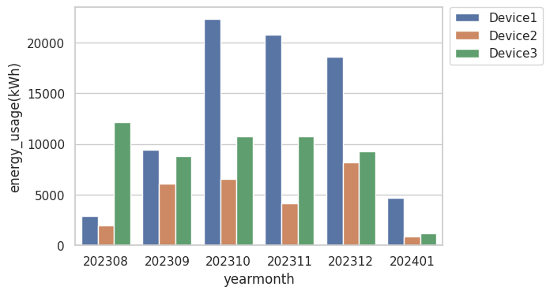

# TAPO_api_p115_pythonplot
Uses TAPO API to get monthly energy usage from all devices into one plot, from today to 6 months back.

Creates the following plot:

Based on:

https://github.com/mihai-dinculescu/tapo/tree/main

https://github.com/mihai-dinculescu/tapo/blob/main/tapo-py/examples/tapo_p110.py

https://github.com/mihai-dinculescu/tapo/blob/main/tapo-py/tapo.pyi
